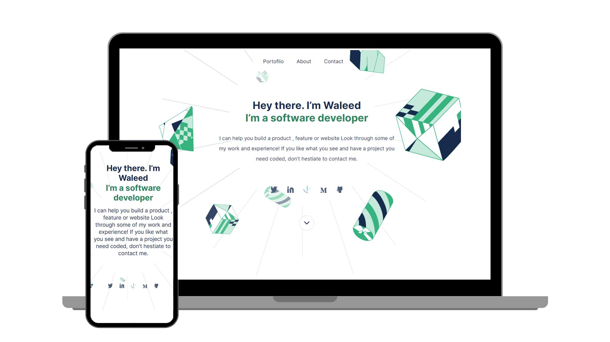

Portfolio Template: 
## Welcome! 👋          

## Built With

- ✔️ HTML, CSS, JavaScript😉
- ✔️ No FrameWork is Used.😋
- ✔️ Grid, FlexBox is used to position the elements in DOM. ✅
- ✔️ Javascript is used to make the website Interactive.😋
- ✔️ Linter is used to make the project Error Free.✅

## Live Demo (if available)

[Live Demo Link](https://developerwaleed.github.io/Portfolio/)

## Getting Started

To get a local copy up and running follow these simple example steps.

### Prerequisites
A Browser of latest version is recommended.

### Setup
The file "index.html" must be opened to use the project.

### Install
A browser must be installed in order to open the project.

### Usage
Can be used to make your own portfolio using my template.

## Authors

👤 **Waleed Amjad**

| 👤 Name | Github | Twitter | LinkedIn |
|------|--------|---------|----------|
|Waleed Amjad|[@caasper](https://github.com/caasperr)|[@developerwaleed](https://twitter.com/developerwaleed)|[Waleed Amjad](https://www.linkedin.com/in/waleed-amjad-51930014a/)||

## Show your support

Give a ⭐️ if you like this project!

## Acknowledgments

- Hat tip to Microverse for the inspiration.

## 📝 License

All rights reserved.
